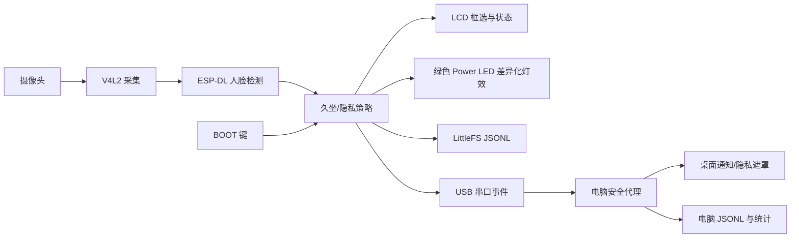

# AgentGuard：基于 openvela 的桌面健康与隐私守护终端

AgentGuard 面向办公室和居家桌面场景，在 ESP32-S3-EYE 上使用 ESP-DL 本地检测人脸，结合久坐计时和多人隐私策略，在不上传摄像头画面的前提下完成提醒、隐私遮挡和事件留存。作品方向为 **AI 硬件产品创新**。

## 已实现功能

- ESP-DL 本地人脸检测，LCD 实时显示检测框和 `FACE:0/1/2` 人数。
- 单人持续在场时累计久坐时间；无人时暂停，达到阈值后在开发板提示并闪灯。
- 隐私模式下检测到两张及以上人脸时触发保护，开发板以不同灯效提示，并通知电脑显示不透明遮罩。
- BOOT 键操作：短按确认提醒；按住 3–7 秒后松开切换隐私模式；按住至少 8 秒后松开切换演示模式。
- 开发板 LittleFS 与电脑 JSONL 双端事件记录；电脑端可统计久坐、确认及隐私触发次数。
- USB 串口优先的电脑端安全代理，也可使用带 Bearer Token 的 HTTP 接口。
- 摄像头、模型或电脑代理异常时保持界面可见和本地策略运行，不把通信故障扩散到推理循环。

本提交不包含主人身份识别、关键词语音识别或摄像头手势识别。板载 MENU/UP 等电阻按键在当前硬件读数不可区分，因此最终交互统一使用可稳定读取的 BOOT 键。

## 系统架构



算法层尽可能保留 ESP-DL 官方实现，项目代码主要提供 ESP-DL 到 NuttX/openvela 的图像、内存和任务兼容层，以及产品策略与交互层。

## 目录

- `app/agentguard/`：openvela/NuttX 应用、ESP-DL 兼容层和主机单元测试。
- `monitor/`：电脑端 USB/HTTP 代理、JSONL 日志与统计工具。
- `tools/`：配置和构建辅助脚本。
- `skills/`：开发期 AgentGuard 自定义 Coding Skill。
- `docs/submission/`：提交检查清单、官网要求核对和演示视频脚本；报告/PPT 成品及源稿不进入仓库。
- `logs/`：已导出的 Claude Code 与 Codex AI Coding 对话日志及 manifest。

## 编译与烧录

在完整 openvela 工作区中执行：

```bash
cd contest2026_123_momohuhuhuluobudui
tools/apply_agentguard_config.sh

source <openvela-root>/myenv/bin/activate
make -C <openvela-root>/nuttx -j8
```

该配置脚本还会幂等应用 ESP32-S3 CAM 的 VSYNC 稳定性补丁，避免每帧人为翻转
VSYNC 极性造成摄像头预览出现移动黑横条；重复执行不会重复修改 NuttX 源码。

生成的 `nuttx.bin` 必须小于 `0x300000`，因为 `0x300000..0x3fffff` 用于 LittleFS。烧录时不要使用会擦除整个 Flash 的 `erase-flash`，以免清除历史事件。具体 JTAG 烧录参数见 [应用说明](app/agentguard/README.md)。

进入 NSH 后运行：

```text
nsh> agentguard &
```

## 电脑端运行与统计

推荐用 USB 启动器，它会自动等待设备并在断线后重连：

```bash
cd monitor
python3 run_usb.py
```

录制视频或现场演示推荐一键启动实时统计面板：

```bash
cd monitor
python3 run_demo.py
```

浏览器将打开 `http://127.0.0.1:8765`，每 2 秒刷新今日/累计数据和最近事件。
Ubuntu/Debian 需要先安装 `python3-tk`，电脑端全屏隐私遮罩依赖该组件：

```bash
sudo apt-get install -y python3-tk
```

默认日志位于 `~/.local/state/agentguard/events.jsonl`（设置 `XDG_STATE_HOME` 时跟随该目录）。查看累计统计：

```bash
python3 event_stats.py
python3 event_stats.py --json
python3 event_stats.py /path/to/events.jsonl
python3 event_stats.py --csv agentguard-events.csv
```

输出包含有效事件总数、久坐提醒次数、用户确认次数、实际隐私遮罩触发次数和损坏日志行数。隐私次数统计 `blur_screen`，避免把仅开启隐私模式误算成真正的隐私事件。详见 [电脑代理说明](monitor/README.md)。

## 操作方式

| 操作 | 结果 |
| --- | --- |
| 短按 BOOT | 确认当前提醒并记录 `acknowledged` |
| 按住 BOOT 3–7 秒，松开 | 开启/关闭隐私模式 |
| 按住 BOOT ≥8 秒，松开 | 开启/关闭 Demo（久坐阈值缩短至 20 秒） |
| 隐私模式中出现第二张脸 | LCD 隐私提示、专用灯效、电脑遮罩与 `blur_screen` 事件 |

LCD 底栏显示 `P:ON/OFF` 和 `D:ON/OFF`，分别表示隐私与 Demo 模式，不再显示按键 ADC 诊断值。

## 验证状态

已在 ESP32-S3-EYE 实机验证：空场景稳定为 `FACE:0`；单张正面人脸为 `FACE:1` 并显示一个框；两张人脸基本稳定为 `FACE:2` 并显示两个框；久坐提醒、确认、隐私切换、Demo 切换、电脑通知和隐私遮罩均可用。当前单帧推理约 840 ms，受画面和调试配置影响。

主机测试：

```bash
make -C app/agentguard/tests clean test
cd monitor
python3 -m unittest -v test_agentguard_pc.py test_run_usb.py \
  test_event_stats.py test_dashboard.py test_run_demo.py
```

目前没有用标准数据集测量识别准确率，也尚未完成整机功耗和长时间稳定性量化，因此报告中不虚构这些数字；提交前建议补充至少 2 小时持续运行记录。

## 提交材料

- [提交检查清单](docs/submission/提交检查清单.md)
- [5 分钟演示视频脚本](docs/submission/演示视频脚本.md)
- [官网要求核对](docs/submission/官网要求核对.md)
- [最终提交材料目录](submission/README.md)

## AI Coding 说明

本项目使用 AI 辅助完成需求裁剪、ESP-DL/NuttX 适配、故障诊断、测试设计、电脑代理和文档整理。开发过程始终以实机输出和自动化测试复核建议。`logs/yhx06/` 已归档 37 个 Claude Code/Codex 会话、10,970 条事件，并通过赛事官方日志校验器；Codex 原始会话经 `tools/import_codex_logs.py` 转换和隐私脱敏后入库，原始会话文件不提交。仓库中的 `skills/develop-agentguard-openvela/` 是开发期 Coding Skill，并非部署在开发板 `/data/agent/skills/` 下的 LLM 运行时 Skill；本作品的核心 AI 能力是板端 ESP-DL 视觉推理。

第三方 ESP-DL 代码及许可见 `app/agentguard/third_party/esp-dl/`。
